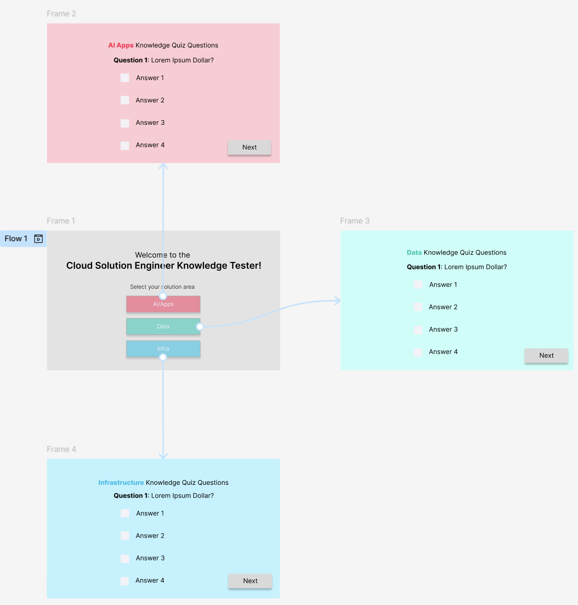
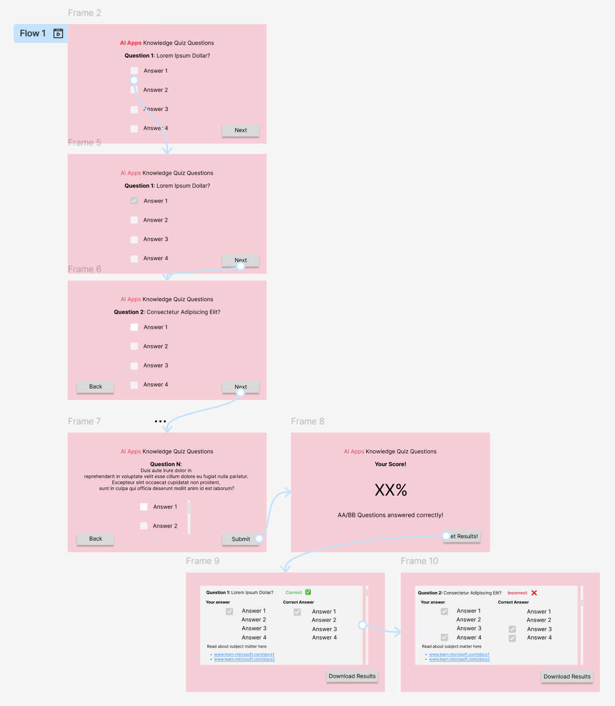

# IFCSP-AE2-SE-Knowledge-Quiz

## Introduction

_Provide a concise overview of your workplace environment and explain the relevance of your proposed MVP to your employer. (300 words +/- 20%)_

Microsoft's sales and commercial organisation, Microsoft Customer and Partner Solutions (MCAPS), delivers consultation-like sales to customers, working with third party vendors to help showcase the value of Microsoft's technology to a range of customers and clients. Within MCAPS, solution engineers sit within the pre-sales sub-organisation called the Specialist Teams Unit, which work with clients and customers to help them understand how they can use Microsoft technlogy within their organisation and secure a sales win. Solution engineers are deeply technical, but also consultative - they need to understand how to apply the technology in various nuanced and sometimes complex client situations. In order to be prepared, they will not only need to know and understand their specific technology area, but also how to know when and where to apply it. 

There are solution engineers for each of the various types of technology. For Azure cloud computing, there are three types of solution engineers - those who specialise in data platforms and tools (Data), cloud infrastructure (Infra), and AI and application technologies (AI/Apps).

This quiz is aimed at testing the various areas of knowledge a solution engineer must know for their specific technology stack and providing various example customer scenarios that will help them think about how they can apply their knowledge to their day to day jobs.

This application will be developed as an MVP using Python (with applicable libraries) and Tkinter, with data stored in a CSV, but this can be substituted with any other permanent data storage, such as a SQL database. No personal data will be stored, however, a CSV extraction of links and resources they would like to work on will be generated and provided to the user. 

Because this is an MVP, only essential functionality is within scope e.g. input validation, quiz functionality, score keeping, curation of links and resources. This is such that development can continue upon validation of the MVP. 


## Design

_This section has no word limit and may include bullet-pointed lists, tables and images._
- _A GUI Design using Figma or another prototyping tool. Include screenshots and (optionally) a link. The design should be specific to your application and show the planned user journey._
- _Functional and Non-functional Requirements. Clearly outline what your application must do and how it should perform._ 
- _A Tech Stack Outline. Briefly describe the languages, libraries, tools, and storage methods you plan to use._ 
- _A Code Design Document. Provide a class diagram or similar documentation to illustrate your code design._ 

There is no text input - this limits the invalidity of user input into the app. 

Only allow one TopLevel window to exist at a time - TopLevel windows will host the quizes for each of the solution area; the main window may still be open - if a user presses on another solution area, while the top level is open, a message box warning will occur, asking the user to finish their quiz, or quit, before opening a new quiz.

### GUI Design




### Functional and Non-Functional Requirements

### User Persona Map
Include a user persona here

### Tech Stack and Code Design

## Development

_In this section, include relevant code blocks using triple backticks (```) to format your code clearly. Explain how your application works by describing the main parts of your code, such as important functions, classes, or modules. Provide enough detail to demonstrate your understanding of how each part contributes to the overall functionality. There is no word limit; focus on clarity and completeness._

## Testing

_Explain your approach to testing your digital product, demonstrating a systematic and strategic approach. Address the following topics:_ 
- _Testing strategy and methodology (summarise and justify different methods of testing you have used, for example, manual and automated unit testing) _
- _Outcomes of application testing:_ 
    - _The outcome of manual tests (should be presented in a tabular format)._ 
    - _Unit testing outcome (should include screenshots of tests running - passing or failing)._ 

### Testing Strategy and Methodology

### Testing Outcomes

## Documentation 

_User documentation should explain how end users, such as staff within your organisation, can interact with the quiz application, whereas technical documentation should outline steps such as running tests locally and explain parts of the code._

### User documentation

### Technical documentation

## Evaluation 
_The evaluation section should explain what went well during the development of the project and what could have been improved. The evaluation section should be written in a genuine, reflective tone. As the README follows the conventions of software documentation, hyperlinks should be used for references instead of Harvard referencing._

If I had more time, I would streamline the code even more: QuestionFrame and AnswerFrame share a lot of the same code - so there would have been a boiler plate class that both would inherit from. If I had more time, I would have generated a set of links to be downloaded!!