# IFCSP AE2: Cloud & AI Solution Engineering Knowledge Quiz

## Introduction
Microsoft's sales and commercial organisation, Microsoft Customer and Partner Solutions (MCAPS), delivers consultative sales engagement, working with third party vendors to showcase the value of Microsoft's technology to a range of customers and clients. Solution engineers work within the pre-sales sub-organisation called the Specialist Teams Unit, which work with clients and customers to help them understand how they can use Microsoft technlogy within their organisation, helping to secure a sales win. Solution engineers are deeply technical, but also consultative - they need to understand how to apply the technology in various nuanced and sometimes complex client situations. In order to be prepared, they will not only need to know and understand their specific technology area, but also how to know when and where to apply it. 

There are solution engineers for each of the various types of technology. For Azure cloud computing, there are three types of solution engineers - those who specialise in data platforms and tools (Data), cloud infrastructure (Infra), and AI and application technologies (AI/Apps). These are known as solution areas.

This quiz is aimed at testing the various areas of knowledge a solution engineer must know for their specific technology stack and providing various example customer scenarios that will help them think about how they can apply their knowledge to their day to day jobs.

This application will be developed as an MVP using Python (with applicable libraries) and Tkinter, with data stored in a CSV, but this can be substituted with any other permanent data storage, such as a SQL database. No personal data will be stored.

Because this is an MVP, only essential functionality is within scope e.g. input validation, quiz functionality, score keeping, display of links and resources. This is such that development and improvement can continue upon validation of the MVP. 


## Design 

### GUI Design


### Functional and Non-Functional Requirements

Functional Requirements:
- The App must present three choices of quiz topic for the user to select: AI/Apps, Data, Infrastructure, as buttons
- When user submits their choice, App must ask if they are sure, and give them the ability to go back.
- The App must display one question at a time from the topic chosen by the user.
- The App must allow for the navigation between questions using a button that navigates to the next question and one that navigates to the previous one
- App must store each answer selected, and allow the user to return to it and change it
- The first question must only allow the user to navigate to the next question, and the last question provide a way to submit their entire set of answers.
- When user submits their answers, App must ask if they are sure, and give them the ability to go back.
- When user confirms their answer submission, the App must display their score as a percentage and as a raw numerical score, and provide a button that navigates them to look at each answer.
- App must display each answer break down one at a time, with the answer they got right or wrong, the correct answer and an explanation of the correct answer.
- With each answer break down, App must also present a series of hyperlinks to documentation and further reading.
- App must provide buttons to navigate through each answer breakdown.
- App should pull questions, answers and documentation links for each question from the provided CSV files. 

Non-functional Requirements:
- The GUI should be consistent, predictable and easily navigable. 
- The interface should only allow the user to interact with the system through clicking buttons only.
- User can only select at most one answer - not more than one.
- App should navigate spin up, tear down or navigate through each window and frame near instantaneously.
- Pop up messages should appear near instantaneously and be succinct in words.

### User Persona Map
The user persona details the type of individual that this app aims to cater for. 

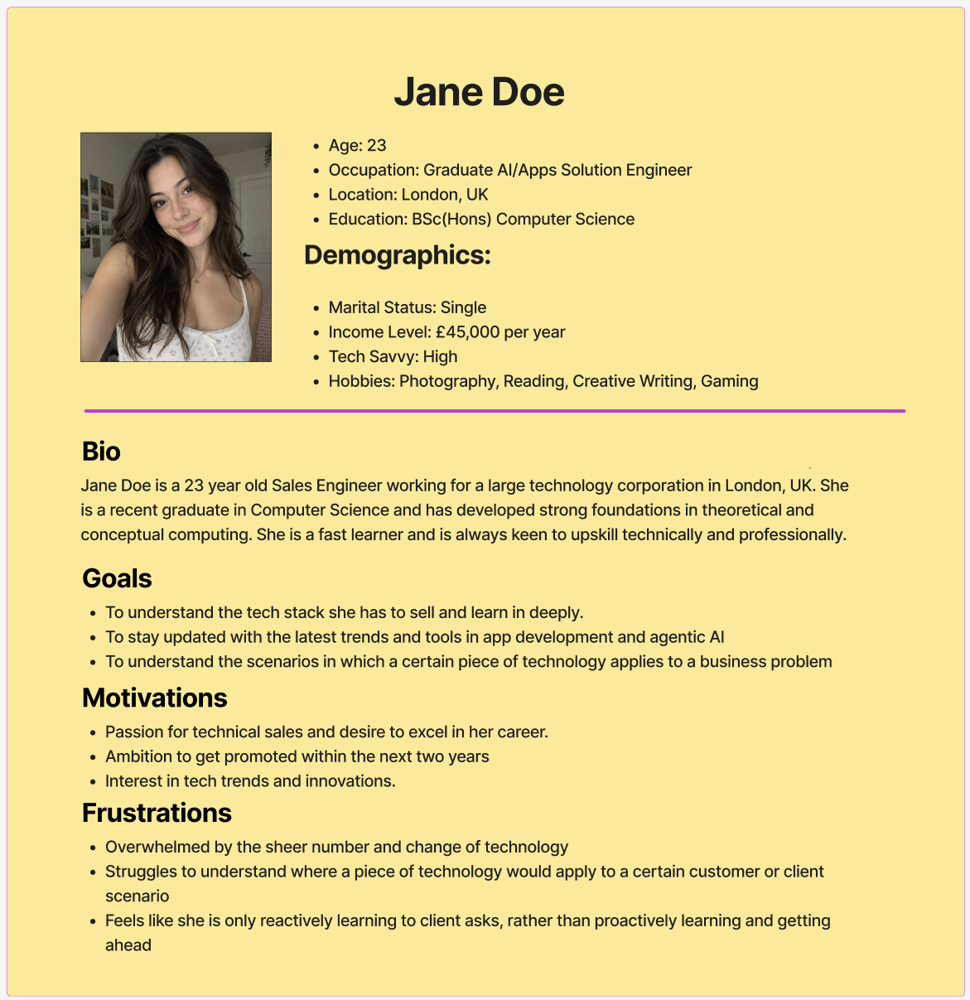

### Tech Stack and Code Design

The program is entirely written in Python, with the following libraries used throughout the application:
- ```tkinter``` for GUI
- ```pandas``` for structured data access and filtering
- ```webbrowser``` for hyperlink capabilities 
- ```unittest``` and ```unittest.mock``` for unit and integration testing, and for the mock and isolate functionality within the unittests

Because this is a brief proof of concept to demonstrate that this quiz app is possible, CSV files have been used for permanent storage for questions, answers and resource links, but this can just as easily be replaced by a database e.g. PostgreSQL. 

The following is the code design diagram for application:

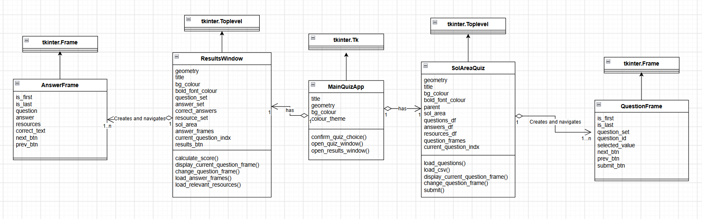

## Development

There are three python files that run the application - ```main.py```, ```quiz_page.py```, ```results_page.py```

### MainQuizApp - ```main.py```

```
class MainQuizApp(tk.Tk):
    """
    Main App Window that will display options for user

    This is the main Tk application that carries the rest of the windows and other parts of the application. 

    It initialises the Main Title for Window, creates instructions for the user, and creates button options for different solution area / topic option, which are bound to a method that checks to confirm the user's choice
    Methods:
        confirm_quiz_choice
        open_quiz_window
        open_results_window
    """

    def confirm_quiz_choice(self, choice):
        '''
        Produces message box to confirm if user has made the right choice, then triggers another method that opens another quiz app window.
        
        args:
            choice (str): the selected quiz topic as a string
        returns:
            True (bool): if there are no Exceptions thrown
            OR False if there are exceptions thrown
        '''

    def open_quiz_window(self, choice):
        """
        Creates seperate window to host quiz of user's choice

        args:
            choice (str): the selected quiz topic as a string
        returns:
            "OK" (str): if there are no Exceptions thrown
            OR e (Exception) if there are exceptions thrown
        """

    def open_results_window(self, question_set, answer_set, resources_set, sol_area, *colours):
        """
        Creates seperate window to host display results of user's quiz

        args:
            question_set (QuestionFrame): list of questions in the form on tk.Frames, with the associated user answers
            answer_set (pandas.DataFrame): corresponding set of answers for the questions, loaded from csv file into a pandas df
            resource_set (pandas.DataFrame): corresponding set of documentation links for the questions and answers, loaded from csv file into a pandas df
            sol_area (str): the selected quiz topic as a string
            colours (tuple of str): colour theme for the results window as a tuple of two hex strings
        returns:
            True (bool): if there are no Exceptions thrown
            OR False if there are exceptions thrown
        
        """

```

### SolAreaQuiz - ```quiz_page.py```

```

class SolAreaQuiz(tk.Toplevel):
    """
    Main quiz window for the application.

    It contains several tk.Frames (QuestionFrames) that display each question, and buttons that navigate to the next or previous question.
    
    It has a colour theme depending on the topic the user chooses.

    It imports the question, answer and resource data from CSVs and loads them into Pandas DataFrames and displays the first question.
    
    Methods:
        load_questions
        load_csv
        display_current_question_frame
        change_question_frame
        submit
    """

    def load_questions(self, questions_df):
        """
        Extracts question set from provided data frame and creates a list of QuestionFrame objects that will be used to display each question
                
        args:
            questions_df (pd.DataFrame): question set in a DataFrame
        returns:
            qfs (list[QuestionFrame]): a list of QuestionFrames
            OR False (bool) if there are exceptions thrown
        """


    def load_csv(self, choice, csv_type):
        """
        Extracts data from csv and loads them into a pandas DataFrame
                
        args:
            choice (str): the selected quiz topic as a string
            csv_type (str): whether the csv contains answer, questions, or resources for further reading, as a string
        returns:
            pandas DataFrame of chosen content
        """

    def display_current_question_frame(self):
        """
        Displays the chosen QuestionFrame on the main quiz window
                
        args:
            None
        returns:
            None
        """

    def change_question_frame(self, direction):
        """
        Changes the QuestionFrame and invokes another method to display it
                
        args:
            None
        returns:
            None
        """

    def submit(self):
        """
        Submits the users answers by sending the list of question frames, and the associated answers, resources etc to a new window

        Destroys / shuts the current quiz window down.
                
        args:
            None
        returns:
            True (bool) if there are no exceptions thrown
            False (bool) if there is
        """
```

### QuestionFrame - ```quiz_page.py```

```
class QuestionFrame(tk.Frame):
    """
    A tk.Frame that will sit on the main quiz window. 

    This will display the question text and the answer options from which the user picks.

    It will present buttons to navigate to a new QuestionFrame, which the window will display

    It will save the user's answer selection - they can navigate back to the QuestionFrame and change their answer, which will also be saved

    The last QuestionFrame will have an option to submit the final set of answers (in the QuestionFrames), which quiz window will handle the request of.

    There are no methods in this class
    
    """
```

### ResultsWindow - ```results_window.py```

```
class ResultsWindow(tk.Toplevel):
    """
    Main results window for the application that displays the results of each user answer one at a time.

    Displays tk.Frames (AnswerFrame) one at a time, with buttons to navigate to the next or previous answer breakdown
    
    It has a colour theme depending on the topic the user chooses.

    It assumes that the question set containing user answers, correct ground truth answer set, the set of documentation and resource links for further reading are already available
    
    Methods:
        calculate_score
        display_current_question_frame
        change_question_frame
        load_answer_frames
        load_relevant_resources
    """

    def calculate_score(self, question_set, correct_answers, percent=True):
        """
        Calculates score for the user.

        args:
            question_set (list[QuestionFrame]): question frame object list with the user selected answers for each one
            correct_answers (pd.DataFrame): ground truth correct answers for comparison
        returns:
            score (int): either as a percentage or the raw number

        """

    def display_current_answer_frame(self):
        """
        Displays the chosen AnswerFrame on the main quiz window
                
        args:
            None
        returns:
            None
        """

    def change_answer_frame(self, direction):
        """
        Changes the AnswerFrame and invokes another method to display it
                
        args:
            None
        returns:
            None
        """


    def load_answer_frames(self):
        """
        Extracts ground truth answer set from provided data frame and user answers and creates a list of AnswerFrame objects that will be used to display each answer breakdown
        Displays the first AnswerFrame and gets rid of a now redundant button.

        args:
            None
        returns:
            None
        """


    def load_relevant_resources(self, resource_set, question_id):
        """
        Extracts ground truth answer set from provided data frame and creates a list of AnswerFrame objects that will be used to display each answer breakdown
        Displays the first AnswerFrame and gets rid of a now redundant button.

        args:
            resource_set (DataFrame)
            question_id (int)
        returns:
            subset of resource_set(DataFrame or Series)
        """

```

### AnswerFrame - ```results_window.py```

```
class AnswerFrame(tk.Frame):

    """
        A tk.Frame that will sit on the results window. 
    
        This will display the question text, the user answer, the correct answer, the explanation behind the correct answer and hyperlinks to read further
    
        It will present buttons to navigate to a new AnswerFrame, which the window will display
    

    """
```


## Testing

### Testing Strategy and Methodology

Manual testing and an iterative approach was mainly used to test the app as it was being developed. The next section details some of the outcomes of manual testing. For specific functionality within the app itself, unit testing with integration testing was used via ```unittest```. Some functionality that the being tested methods relied on needed to be abstracted, so ```unittest.mock``` provided the abilitiy to mock that functionality, so that the method itself was tested. 

Manual testing was the main method of testing since the application is GUI based, and so needed visual validation. Some automated testing was done in order to test some pure functions, and as more of an exercise in using ```patch``` and ```Mock / MagicMock```.

### Testing Outcomes

#### Manual testing

The following is a table that contains a subset of the manual testing done at the beginning of the development process.

| What is being tested | Expected Outcome | Actual Outcome | Notes |
| -------------------- | ---------------- | -------------- | ----- |
| If blank app with blank grey window is generated, with the title of the window at the window | Blank grey window pops up | Same as Expected outcome | |
| Add a text label "Welcome to the" and place it on the blank window | Text appears on the window when generated | Same as Expected Outcome | |
| Underneath "Welcome to the" place bigger and bolder text "Cloud & AI Solution Engineering Knowledge Tester" | Text appears on the window when generated | Same as Expected Outcome | I will reduce the font size slightly and/or increase the window size |
| Add instructions, inside a white or lighter grey box, for the quiz. The text should wrap to a new line if it's longer then the width of the box | Instructions in a lighter coloured box / frame that is wrapped around to new line if longer than box width. | Technically same as expected outcome, but inappropriate design | I will change the width and length of the box, and add padding to this box |
| Add "Choose a Solution Area! 👇" As lighter or white text underneath instructions | "Choose a Solution Area! 👇" appears underneath instructions as bigger and lighter text with background same grey color as window | Error occurred – incorrect method of setting fond color | Corrected by using fg parameter in Label instead |
| Add AI/Apps button with a coloured background and white text. Command method for button should do nothing for now. | AI Apps button underneath "Choose Solution Area" text, with a pink background and white text. Upon clicking, nothing should be done | As expected | Will widen button and reduce colour saturation |
| Add Data and Infrastructure buttons with a coloured background and white text. Command method for button should do nothing for now. | Buttons appear underneath AI/Apps, with a pink background and white text. Upon clicking, nothing should be done or something | As expected | |
| Add in a message box upon pressing any of the three buttons that warns about permanent choice | Yes No Cancel message box appears reiterating choice and making sure that the user knows that this is permanent | As expected | |
| Presence check for confirm choice method | Checks if only True result from messagebox gets printed – to be used for downstream services. | As expected | |
| Create a new window if choice is confirmed | A blank window pops up when choice is confirmed | As expected | |
| Colour the new window with appropriate theme colour for solution area | A coloured window appears depending on what the solution area is, with bold, coloured text displaying the name  | As expected | |
| Add text for solution area name and "Knowledge Quiz" next to it. | "[Solution Area Name] Knowledge Quiz" will appear at the top middle of the new window | As Expected | Used tk.Frame for positioning |
| Add question text, radio buttons and next button  | Question text appears at the top, with four options as radio buttons in the middle, with a button to move onto the next question at the bottom | They appear but are misaligned in position and colour | |

#### Unit testing

The following is the results of some of the integration and unit testing. For each main python application file, there is a test python script.

*```test_main.py```*

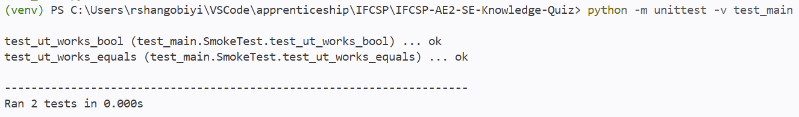
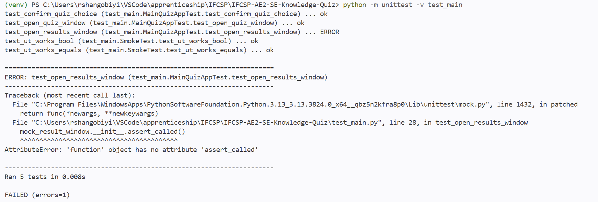
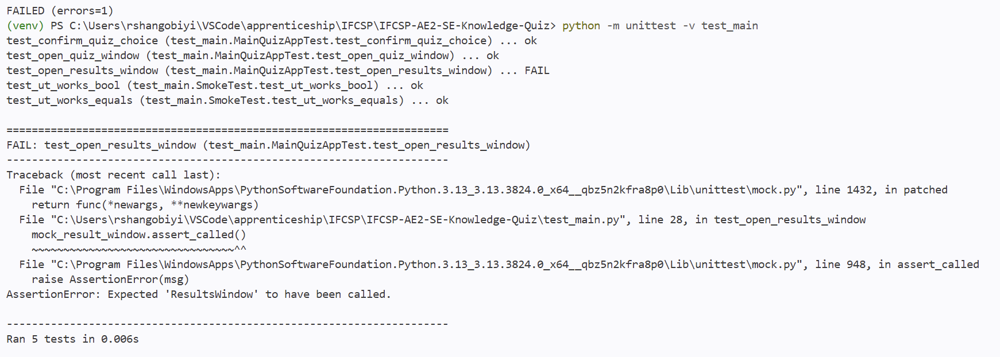
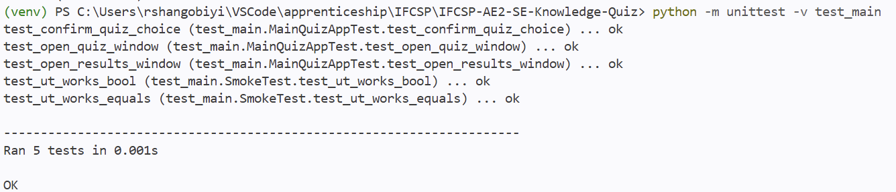
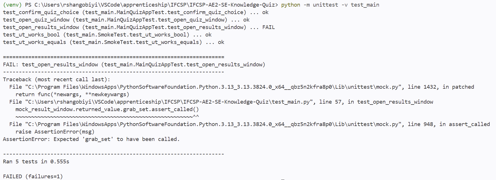
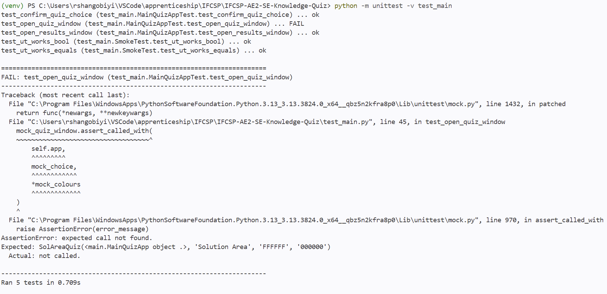
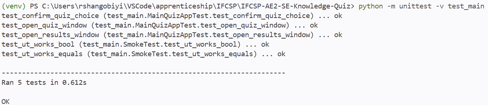

*```test_quiz_page.py```*

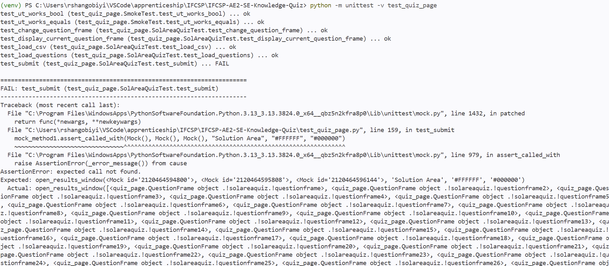
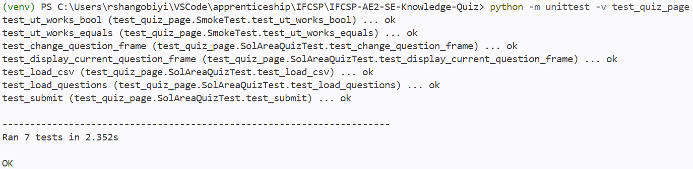

*```test_results_page.py```*

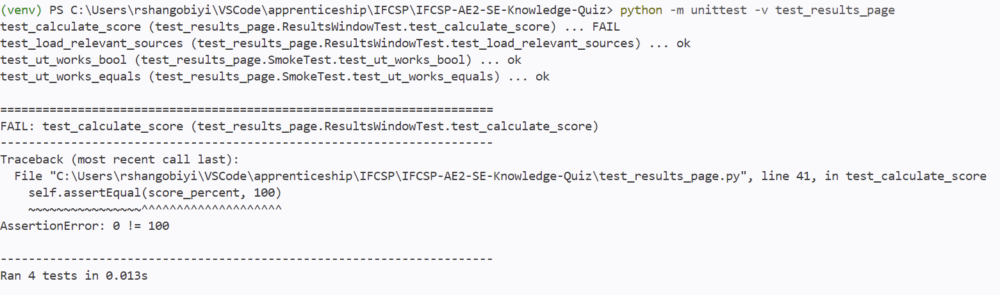
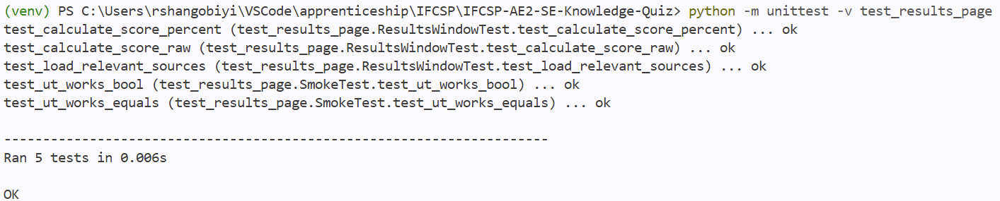

## Documentation

To run this application:

1. Open this repo in VSCode
2. Go to the top left menu bar, and select Terminal, then New Terminal
3. The terminal will pop up at the bottom of the screen. Enter and run the following command: ```venv\Scripts\Activate.ps1```
4. Then run ```python main.py```

The start window should pop up:

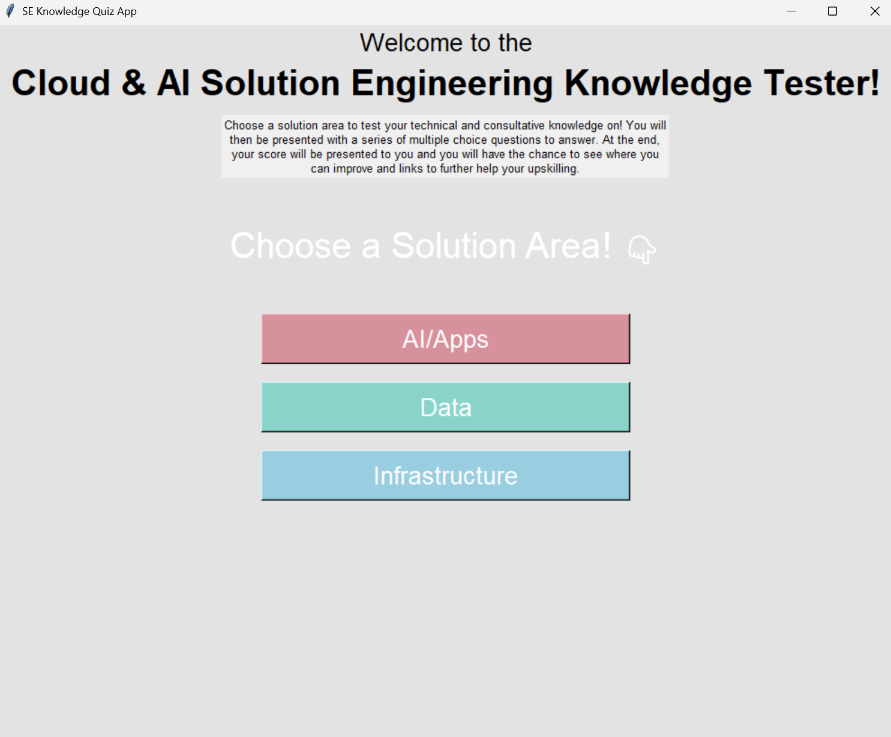

### User documentation

Run through the steps detailed above. The GUI has been intentionally made to be easily navigable, with only buttons to be pressed by the user.

Select your chosen solution area you want to test your knowledge on. 

You will then be presented with a series of questions, one after the other, of which there is only one answer to. Select that answer and click Next to navigate to the next question. You also have the option to naviagte back to previous questions and to check your answers. You can also leave a question blank. When you get to the last question, there will be a button to either travel back or proceed to submit your answers. You are advised to go back and double check any answers you left blank or are unsure about. 

When you submit, you will be presented with your score as a percentage and as the number of questions you correctly answered out of the total. You will then be given the option to look at each question and answer break down, which will display your answer, the correct answer, whether you correctly or incorrectly answered the question, an explanation of why, and a list of hyperlinks to documentation for further reading. You can navigate back and forth between each answer and its breakdown.


### Technical documentation

This app is made using Python 3.13.14. Please look at ```requirements.txt``` for package dependencies to install.

This repository is available from ```https://github.com/ruthyishere/IFCSP-AE2-SE-Knowledge-Quiz/tree/main``` - please clone the repository if you would like a local version of it by running the following git command.

Windows and Mac: ```git clone "https://github.com/ruthyishere/IFCSP-AE2-SE-Knowledge-Quiz.git"```

To run the required package dependencies, run the following command in the terminal: ```pip install -r requirements.txt```

Questions, answers and resources (which are links to documentation and further reading surrounding a question and answer) are stored in CSV files as an intriem solution. They can be replaced by a SQL database later down the line.

Each solution area has three CSV files, each for the set of questions, corresponding answers and resources.

Columns and column data types for questions are as follows:
```
question_id (int) (PK),
solution_area (str),
domain (str),
subdomain (str),
question_type (str),
level (int),
question_text (str),
option_a (str),
option_b (str),
option_c (str),
option_d (str)
```

Columns for answers are as follows:
```
answer_id (int) (PK),
question_id (int) (FK),
correct_option (char),
correct_answer_text (str),
rationale (str),
scenario_anchor (str)
```

Columns for resources are as follows:
```
resource_id (int) (PK),
question_id (int) (FK),
resource_title (str),
resource_url (str),
source_type (str)
```

To add a question, it'll be easier to add a question at the end of teh question set, instead of the the start or middle, as it will require updating ```question_id``` for all questions in all csv files. When adding a question, remember to add the appropriate answer and resource to the other csv files, making note to add the appropriate primary key and foreign keys. ```question_id`` is a foreign key in all csv tables.

If there are any missing or malformed csv files, the app will inform you, such as in the following example:

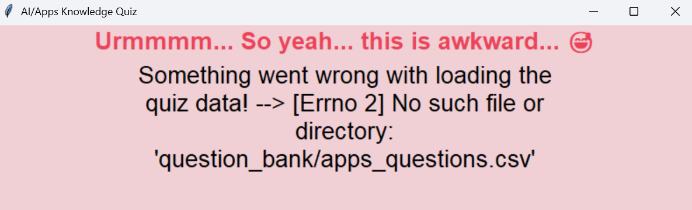

To add a solution area, add the three extra csv files for questions, answers and resources in the following format:
```
<solution area>_questions.csv
<solution area>_answers.csv
<solution area>_resources.csv
```

For example:

```
copilot_questions.csv
copilot_answers.csv
copilot_resources.csv
```
Make sure you provide the same schema as detailed above for each row you provide each csv file.

Then, navigate to ```main.MainAppQuiz``` to add a colour theme and an button, like in this example:

```
class MainQuizApp(tk.Tk):
    ...
    self.colour_theme = {
                "AI/Apps":[ "#d7919d", "#f0cfd5", "#eb445a"],
                "Data": ["#8ad3cb", "#d1fdf9", "#5ac5b3"],
                "Infrastructure":[ "#99cde0", "#c7f1fd", "#5cc1e6"]
                "Copilot": ["#d9d982", "#f9f9c1", "#e7e74a"]
            }
    ...
    tk.Button(self,
                text="Copilot",
                bg=self.colour_theme["Copilot"][0],
                fg="white",
                font=('Arial', 20),
                width = 25,
                command=lambda: self.confirm_quiz_choice("Copilot")).pack(pady=10)
    ...
```

Then navigate to ```quiz_page.SolAreaQuz``` to add the following, like in this example:

```
class SolAreaQuiz(tk.Toplevel):
    ...
    sol_area_map = {"AI/Apps": "apps", 
                    "Data": "data", 
                    "Infrastructure": "infra",
                    "Copilot": <>}
```

To run the unit tests, run the following commands in the terminal to run them.
- To test ```main.py```: run ```python -m unittest -v test_main```
- To test ```quiz_page.py```: run ```python -m unittest -v test_quiz_page```
- To test ```results_page.py```: run ```python -m unittest -v test_results_page```

## Evaluation

There is an initiative within my department to create resources for early in career solution engineers to understand their solution area and upskill deeply and conversationally. There will be a variety of customer / client scenarios where they will be asked to apply their technical knowledge to business needs and problems. I think the development of the app is something I can demo and share with the team leading this initiative, so that they can build upon it and develop it for further use. 

What went "well" is entirely dependent on subjective metrics of "success", but I can say that I did mostly enjoy writing code and developing, and manually testing it. The unittest are, however, a bit verbose, and could be streamlined and simplified. They were the hardest to build, due to the use of [```patch``` and ```Mock/MagicMock```](https://docs.python.org/3/library/unittest.mock.html) - this functionality was very difficult to understand and implement. 

If I had more time, I would streamline the code even more: QuestionFrame and AnswerFrame share a lot of the same code - so there could have been a class that both would inherit from. I would also have generated a set of links to be downloaded as a CSV file after the user has checked their marked answers. I would have also created an interface where an admin can add questions, answers and resources easily and seamlessly, which would most likely require the CSVs to be replaced by a database. I could also use Flask or Streamlit as the GUI interface, and deploy this as a web app. I would have spent more time making sure that the app was also easier for developers to update.

Most of the time was spent trying to make the GUI work properly, as opposed to the backend functionality of the app. It made me realise that backend development is something I enjoy more.

